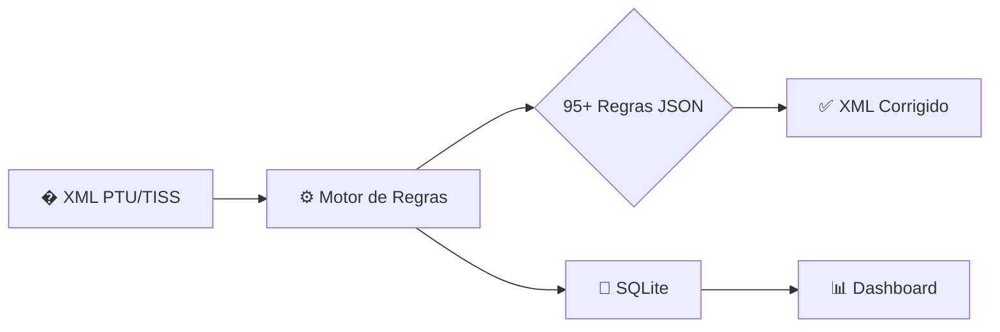

# Audit+ (AuditPlus) v3.0

**Sistema inteligente de auditoria, validação e correção automática de arquivos PTU/TISS para faturamento de contas médicas (intercâmbio e trânsito).**

Desenvolvido por **Pedro Lucas Lima de Freitas** — Smart Guys Dev.

---

## 🏗️ Arquitetura



**Fluxo principal:**

1. O usuário importa os XMLs de faturamento
2. O Motor de Regras carrega 95+ regras do banco (sincronizadas automaticamente do JSON)
3. Cada regra é avaliada contra os elementos XML (condições recursivas AND/OR)
4. As correções são aplicadas e o XML corrigido é salvo
5. O Dashboard exibe KPIs, economia e histórico em tempo real

---

## 📁 Estrutura do Projeto

```
AuditPlusv2.0/
├── main.py                        # Ponto de entrada
├── src/
│   ├── business/
│   │   └── rules/
│   │       └── rule_engine.py     # Motor de regras (95+ regras)
│   ├── config/
│   │   └── regras/                # Regras declarativas em JSON
│   │       ├── equipe_profissional.json
│   │       ├── pj_pf_rotativo.json
│   │       ├── remocao.json
│   │       ├── procedimentos.json
│   │       └── ...
│   ├── database/
│   │   ├── db_manager.py          # Conexão e inicialização
│   │   ├── rule_migrator.py       # Sync automático JSON → DB
│   │   └── rule_repository.py     # CRUD de regras
│   ├── infrastructure/
│   │   ├── parsers/
│   │   │   └── xml_reader.py      # Parser XML com namespaces
│   │   └── logging/
│   │       └── logger_config.py
│   └── views/                     # Interface PyQt6
│       ├── login_window.py
│       ├── dashboard_widget.py
│       └── ...
└── requirements.txt
```

---

## 📦 Instalação

### Requisitos

- Python 3.11 ou superior
- pip

### Passos

1. Clone o repositório:

```bash
git clone https://github.com/Smart-Guys-Dev/AuditDesk.git
cd AuditDesk
```

2. Crie um ambiente virtual:

```bash
python -m venv venv
```

3. Ative o ambiente virtual:

```bash
# Windows
venv\Scripts\activate

# Linux/Mac
source venv/bin/activate
```

4. Instale as dependências:

```bash
pip install -r requirements.txt
```

---

## 🚀 Uso

```bash
python main.py
```

---

## 🔧 Funcionalidades

### 📄 Processador XML

- Validação e correção automática de arquivos PTU/TISS
- Motor de regras declarativo (JSON → SQLite) com sync automático
- Geração de arquivos corrigidos preservando estrutura original

### ✅ Motor de Regras

- **95+ regras** de validação e correção
- Correção de equipe profissional (PJ → PF com rotação)
- Correção de tp_Participacao por procedimento
- Correção de CNES por CNPJ do prestador
- Rotação de profissionais (solicitante, intensivista, equipe)
- Regras de remoção/ambulância, terapias seriadas e internação
- Sincronização automática JSON ↔ Banco de Dados

### 📊 Dashboard

- KPIs em tempo real
- Economia total / Glosas evitadas
- Taxa de sucesso
- Histórico de execuções

### 📥 Importação de Relatórios

- A500 Enviados
- Distribuição de Faturas
- Faturas Emitidas

### 🔐 Autenticação

- Sistema de login com controle de acesso por perfil
- Suporte a múltiplos usuários

---

## 🛠️ Tecnologias

| Tecnologia       | Uso                                   |
| ---------------- | ------------------------------------- |
| **Python 3.11+** | Linguagem principal                   |
| **PyQt6**        | Interface gráfica                     |
| **SQLAlchemy**   | ORM e persistência                    |
| **lxml**         | Processamento XML de alta performance |
| **pandas**       | Manipulação e análise de dados        |
| **SQLite**       | Banco de dados local                  |

---

## 📝 Licença

Propriedade de **Pedro Lucas Lima de Freitas** — Smart Guys Dev.  
Todos os direitos reservados.

---

## 👨‍💻 Autor

**Pedro Lucas Lima de Freitas**

---

**Audit+** — Auditoria inteligente, glosas eliminadas automaticamente 🚀
